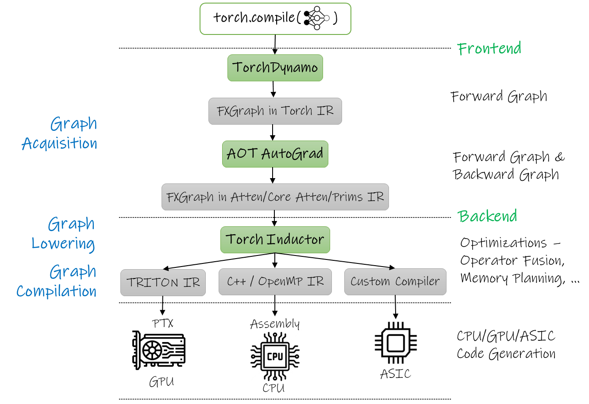

In this article, we explore tecniques to improve training and inference performance of Deep Learning models built using PyTorch.

PyTorch 2.0 introduces new compiler technologies to improve model performance and runtime efficiency and target diverse hardware backends by wrapping model with simple command `torch.compile()`. PyTorch 2.0 compiler translates high-level code written in deep learning frameworks into optimized lower level hardware specific code to accelerate training and inference. To improve performance, a deep learning compiler has to take advantage of hardware specific features such as mixed precision support, performance optimized kernels and minimize communication between host (CPU), Operator Fusion and CPU/GPU Code-Generation and AI accelerator.

There are different phases of the compilation process,

`torch.compile` makes PyTorch code run faster by JIT-compiling PyTorch code into optimized kernels. `torch.compile` significantly enhances model performance by optimizing both the computation graph and the execution of operations on hardware accelerators, leading to faster inference and training times.

## What happens when a model wrapped with `torch.compile(model)`?

When torch.compile is invoked in PyTorch, it performs several background steps to optimize model execution by using several components. The torch.compile model goes through the following steps before execution,

**TorchDynamo** is responsible for JIT compiling arbitrary Python code into FX graphs (a graph of tensor operations), which can then be further optimized. TorchDynamo extracts FX graphs by analyzing Python bytecode during runtime and detecting calls to PyTorch operations. If it comes across a segment of code that it cannot interpret, it defaults to the regular Python interpreter. This approach ensures that it can handle a wide range of programs while providing significant performance improvements.

**AOTAutograd** Automatically generates the backward computation graph from the forward computation graph, ensuring that gradients can be computed efficiently. Its function is to produce backward traces in an ahead-of-time fashion, enhancing the efficiency of the differentiation process. This enables acceleration of both the forward and backward pass.
    
**TorchInductor** The default backend that compiles the computation graph into optimized low-level code suitable for execution on various hardware accelerators. It takes the computation graph generated by TorchDynamo and converts it into optimized low-level kernels. For NVIDIA and AMD GPUs, it employs OpenAI **Triton** 

    Triton is a new programming language that provides much higher productivity than CUDA, but with the ability to beat the performance of highly optimized libraries like cuDNN with clean and simple code. It is developed by Philippe Tillet at OpenAI, and is seeing enormous adoption and traction across the industry. Triton supports NVIDIA GPUs, . It is quickly growing in popularity as a replacement for hand written CUDA kernels.
    
    C++/OpenMP is a widely adopted specification for writing parallel kernels. OpenMP provides a work sharing parallel execution model, and enables support for CPUs.

Let’s now demonstrate that using torch.compile can speed up real models. We will compare standard eager mode and torch.compile by evaluating and training a sample CNN model on CIFAR10 dataset.

## Model performance in Eager mode

## Model performance in torch.compile mode

-------------
 template epilogue fusions, tiling, and horizontal/vertical fusions.
